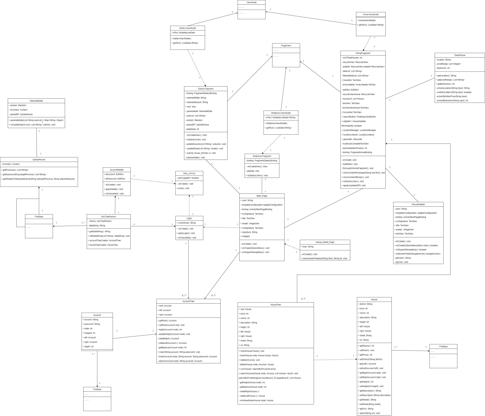

# [GA23S2 - Group 04] Report

## Table of Contents

1. [Team Members and Roles](#team-members-and-roles)
2. [Summary of Individual Contributions](#summary-of-individual-contributions)
3. [Application Description](#application-description)
4. [Application UML](#application-uml)
5. [Application Design and Decisions](#application-design-and-decisions)
6. [Summary of Known Errors and Bugs](#summary-of-known-errors-and-bugs)
7. [Testing Summary](#testing-summary)
8. [Implemented Features](#implemented-features)
9. [Team Meetings](#team-meetings)
10. [Conflict Resolution Protocol](#conflict-resolution-protocol)

## Administrative
- Firebase Repository Link: <https://console.firebase.google.com/project/ga-23s2-a5f8f/database/ga-23s2-a5f8f-default-rtdb/data>
   - Confirm: I have already added comp21006442@gmail.com as a Developer to the Firebase project prior to due date.
- Two user accounts for markers' access are usable on the app's APK (do not change the username and password unless there are exceptional circumstances. Note that they are not real e-mail addresses in use):
   - Username: comp2100@anu.edu.au	Password: comp2100
   - Username: comp6442@anu.edu.au	Password: comp6442

## Team Members and Roles
The key area(s) of responsibilities for each member

| UID        |  Name  |                                                                            Role |
|:-----------|:------:|--------------------------------------------------------------------------------:|
| [u7370733] | [Wangtao Jia] |                        [Front-end Developer, Back-end Developer,UI/UX Designer] |
| [u7630926] | [Xiaochen Lu] | [Back-end Developer,Database Administrator,Quality Assurance Engineer (Tester)] |
| [u7630421] | [Linsheng Zhou] | [Back-end Developer,Database Administrator,Quality Assurance Engineer (Tester)] |
| [u6729279] | [Xiangji Li] |                        [Front-end Developer, Back-end Developer,UI/UX Designer] |

## Summary of Individual Contributions

1. **u7630926, Xiaochen Lu**  I have 25% contribution, as follows:  
  - **Code Contribution in the final App**
    - Feature UploadHouse Information - class UploadHouse: [UploadHouse.java](https://gitlab.cecs.anu.edu.au/u7630421/ga-23s2/-/blob/main/Forum/app/src/main/java/com/example/forum/UploadHouse.java), class GalleryFragment: [GalleryFragment.java](https://gitlab.cecs.anu.edu.au/u7630421/ga-23s2/-/blob/main/Forum/app/src/main/java/com/example/forum/ui/gallery/GalleryFragment.java)
    - Feature Data Simulation - class GenerateData: [Generate.java](https://gitlab.cecs.anu.edu.au/u7630421/ga-23s2/-/blob/main/Forum/app/src/main/java/com/example/forum/GenerateData.java)
    - Feature ReadFromLocalDataBase - class UploadHouse: [UploadHouse.java](https://gitlab.cecs.anu.edu.au/u7630421/ga-23s2/-/blob/main/Forum/app/src/main/java/com/example/forum/UploadHouse.java)
    - UI Design - class GalleryFragment: [GalleryFragment.java](https://gitlab.cecs.anu.edu.au/u7630421/ga-23s2/-/blob/main/Forum/app/src/main/java/com/example/forum/ui/gallery/GalleryFragment.java), XML fragment_gallery: [fragment_gallery.XML](https://gitlab.cecs.anu.edu.au/u7630421/ga-23s2/-/blob/main/Forum/app/src/main/res/layout/fragment_gallery.xml)
    - AccountTreeTest.java: [AccountTreeTest.java](https://gitlab.cecs.anu.edu.au/u7630421/ga-23s2/-/blob/main/Forum/app/src/main/java/com/example/forum/AccountTreeTest.java), HouseTreeTest.java:[HouseTreeTest.java](https://gitlab.cecs.anu.edu.au/u7630421/ga-23s2/-/blob/main/Forum/app/src/main/java/com/example/forum/HouseTreeTest.java), TokenParseTest.java: [TokenParseTest.java](https://gitlab.cecs.anu.edu.au/u7630421/ga-23s2/-/blob/main/Forum/app/src/main/java/com/example/forum/TokenParseTest.java)

  - **Code and App Design** 
    - Being responsible for local database management. Using XML structure to store local data*
    - Being responsible for UploadHouse fragment design. This fragment is used to let users rent out their house by uploading their *   

  - **Others**: (only if significant and significantly different from an "average contribution") 
    - responsible for part of report writing and slides preparation *
    - responsible for unit test

2. **u7630421, Linsheng Zhou**  I have 25% contribution, as follows:  
  - **Code Contribution in the final App**
    - Search-Filter: In [HomeFragment](https://gitlab.cecs.anu.edu.au/u7630421/ga-23s2/-/blob/main/Forum/app/src/main/java/com/example/forum/ui/home/HomeFragment.java#L100-159), based on district info provided by GPS, the user can search all houses located in this district, and the results are sorted by likes decreasingly. 
    - Data-Profile: Displaying avatars, usernames and greetings based on system time oin left side drawer menu in [Main_Page Activity](https://gitlab.cecs.anu.edu.au/u7630421/ga-23s2/-/blob/main/Forum/app/src/main/java/com/example/forum/Main_Page.java#L200-278)
    - Data-GPS: Retrieving the location of virtual device triggered by FAB in [Main_Page Activity](https://gitlab.cecs.anu.edu.au/u7630421/ga-23s2/-/blob/main/Forum/app/src/main/java/com/example/forum/Main_Page.java#L128-170)
    - Data-Graphical: In a pie chart, displaying the percentages of 6 types of houses classified by bedroom numbers in [Class SlideshowFragment](https://gitlab.cecs.anu.edu.au/u7630421/ga-23s2/-/blob/main/Forum/app/src/main/java/com/example/forum/ui/slideshow/SlideshowFragment.java#L32-111)
    - Data-Deletion: Implement a deletion method for [Class AccountTree](https://gitlab.cecs.anu.edu.au/u7630421/ga-23s2/-/blob/main/Forum/app/src/main/java/com/example/forum/AccountTree.java#L140-227) and used in [Class AccountDelete](https://gitlab.cecs.anu.edu.au/u7630421/ga-23s2/-/blob/main/Forum/app/src/main/java/com/example/forum/AccountDelete.java#L68-81)
    - Login: Implemented login function with user details stored in FBDB in [Class LogIn](https://gitlab.cecs.anu.edu.au/u7630421/ga-23s2/-/blob/main/Forum/app/src/main/java/com/example/forum/LogIn.java) based on data structure of [Class Account](https://gitlab.cecs.anu.edu.au/u7630421/ga-23s2/-/blob/main/Forum/app/src/main/java/com/example/forum/Account.java) and [Class AccountTree](https://gitlab.cecs.anu.edu.au/u7630421/ga-23s2/-/blob/main/Forum/app/src/main/java/com/example/forum/AccountTree.java)
    - Design patterns: [Singleton](https://gitlab.cecs.anu.edu.au/u7630421/ga-23s2/-/blob/main/Forum/app/src/main/java/com/example/forum/AVLTreeFactory.java#L13),[State](https://gitlab.cecs.anu.edu.au/u7630421/ga-23s2/-/blob/main/Forum/app/src/main/java/com/example/forum/Account.java#L11),[Iterator(AccountTree)](https://gitlab.cecs.anu.edu.au/u7630421/ga-23s2/-/blob/main/Forum/app/src/main/java/com/example/forum/AccountTree.java#L229-285),[Iterator(HouseTree)](https://gitlab.cecs.anu.edu.au/u7630421/ga-23s2/-/blob/main/Forum/app/src/main/java/com/example/forum/HouseTree.java#L136-190)
    
    - **Code and App Design**
    - Be responsible for data structure for accounts and houses data organization
    - Add data stream in [Main_Page](https://gitlab.cecs.anu.edu.au/u7630421/ga-23s2/-/blob/main/Forum/app/src/main/java/com/example/forum/Main_Page.java#L328-338) to simulate other users uploading new houses with 30s-intervals

    - **Others**: (only if significant and significantly different from an "average contribution")
    - responsible for part of report writing and slides preparation
    - responsible for Meeting minutes.

3. **u7629279, Xiangji Li**  I have 25% contribution, as follows:  
    - **Code Contribution in the final App**
    - Feature Token - class TokenParse: [TokenParse.java](https://gitlab.cecs.anu.edu.au/u7630421/ga-23s2/-/blob/main/Forum/app/src/main/java/com/example/forum/TokenParse.java), 
    - Feature CardViewAdapter - class HouseAdapter: [HouseAdapter.java](https://gitlab.cecs.anu.edu.au/u7630421/ga-23s2/-/blob/main/Forum/app/src/main/java/com/example/forum/HouseAdapter.java)
    - Feature Recycleview and SearchText - class HomeFragment: [HomeFragment.java](https://gitlab.cecs.anu.edu.au/u7630421/ga-23s2/-/blob/main/Forum/app/src/main/java/com/example/forum/ui/home/HomeFragment.java#L161-263),[SearchText](https://gitlab.cecs.anu.edu.au/u7630421/ga-23s2/-/blob/main/Forum/app/src/main/java/com/example/forum/ui/home/HomeFragment.java#L385-485)
    - UI Design - HomepageCardview Show: [HomeFragment.java](https://gitlab.cecs.anu.edu.au/u7630421/ga-23s2/-/blob/main/Forum/app/src/main/java/com/example/forum/ui/home/HomeFragment.java#L423-459)
    - UI Design - LoginPage，HomeFragment Show: [activity_log_in.xml](https://gitlab.cecs.anu.edu.au/u7630421/ga-23s2/-/blob/main/Forum/app/src/main/res/layout/activity_log_in.xml), [activity_main](https://gitlab.cecs.anu.edu.au/u7630421/ga-23s2/-/blob/main/Forum/app/src/main/res/layout/activity_main.xml),[fragment_home](https://gitlab.cecs.anu.edu.au/u7630421/ga-23s2/-/blob/main/Forum/app/src/main/res/layout/fragment_home.xml),[house_cardview](https://gitlab.cecs.anu.edu.au/u7630421/ga-23s2/-/blob/main/Forum/app/src/main/res/layout/house_cardview.xml)
   
    - **Code and App Design**
    - Being responsible for HomePage fragment design. Using CardView and recycleView to load data. Implemented the HouseAdapter class for managing and displaying a list of house listings in a RecyclerView.Designed the layout for individual house listings by inflating the "house_cardview" layout.
      Dynamically selected random background images from a set of resources for each house listing, enhancing the visual appeal of the app.Bound data from the House objects to the respective UI elements, including title, description, and background image.Set an OnClickListener for each house item, enabling users to view detailed information about a selected house.Contributed to the overall functionality and presentation of house listings in the app's UI.*
    - Being responsible for Search edittext. `TokenParse` class, which is responsible for parsing input data to extract location, price range, and number of bedrooms. This class plays a crucial role in filtering and searching for house listings based on user input.It plays a fundamental role in the functionality of the app, allowing users to filter and search for house listings based on their preferences. *   
   
    - **Others**: (only if significant and significantly different from an "average contribution")
    - responsible for part of report writing and slides preparation 
    - responsible for Meeting minutes.
   
4. **u7370733, Wangtao Jia**  I have 25% contribution, as follows:  
    - **Code Contribution in the final App**
    - Feature Show detailed information to users - [House_Detail_Page](https://gitlab.cecs.anu.edu.au/u7630421/ga-23s2/-/blob/main/Forum/app/src/main/java/com/example/forum/House_Detail_Page.java)
    - Interact with firebase in real time - [Save likes to database](https://gitlab.cecs.anu.edu.au/u7630421/ga-23s2/-/blob/main/Forum/app/src/main/java/com/example/forum/House_Detail_Page.java#L96)
    - UI design - [House detail page XML](https://gitlab.cecs.anu.edu.au/u7630421/ga-23s2/-/blob/main/Forum/app/src/main/res/layout/activity_house_detail_page.xml)
    - Feature likes function in house detail page to help users interact with app - [Method like](https://gitlab.cecs.anu.edu.au/u7630421/ga-23s2/-/blob/main/Forum/app/src/main/java/com/example/forum/House_Detail_Page.java#L75)
    - Initial layout and code of search function [HomeFragment.java](https://gitlab.cecs.anu.edu.au/u7630421/ga-23s2/-/blob/main/Forum/app/src/main/java/com/example/forum/ui/home/HomeFragment.java)

   - **Code and App Design**
   - Being responsible to design and draw the whole UML diagram for this app.
   - Being responsible to design suitable house detail page to show relative house information to users, using nested layout design to make the whole page able to be scrolled and beautiful.
   - Being responsible to load suitable pictures for the houses

   - **Others**: (only if significant and significantly different from an "average contribution")
   - responsible for part of report writing and slides preparation
   - responsible for writing basic and custom features in report.

## Application Description

*My app, called "Myplace", is a rental housing application. Upon logging in, users can:*

*1.Location-Based Search: Users can search for rental properties near their current location.*
|   |   |
|---|---|
| {height=400px}  | {height=400px}   |

*2.View Property Details: Users can view detailed information about available rental properties.*
|   |   |
|---|---|
| {height=400px}  | {height=400px}   |

*3.Customized Search: Users can refine their search by specifying location, price, and the number of bedrooms they desire.*
|   |   |
|---|---|
| {height=400px}|{height=400px}|

*4.Listing Properties: The app provides functionality for both regular users and real estate agents to upload details about properties they want to rent out.*
|   |   |
|---|---|
| {height=400px}|{height=400px}|

### Application Use Cases

*Target Users: Individuals looking to rent properties, especially ANU students*

* *Users can explore rental properties near their current location.*
* *Users can search for properties in specific locations.*
* *Users can view property details, including pricing, room configurations, and contact information of the landlord.*

*Target Users: Real estate agents or property owners looking to rent out their properties*

* *Real estate agents or property owners can upload details of their available properties.*
* *They can also check the rental status of properties similar to their own and provide information about their properties.*

 

### Application UML

 

## Code Design and Decisions

***1.***

**Parser and Grammar:**

- It's an Android app adapter for displaying house listings. The data displayed in the RecyclerView driven by the data provided in the `houseList`.

**Design Patterns:**

- **Adapter Design Pattern:** The code implements the Adapter design pattern, which is a structural pattern commonly used in Android development for efficiently binding data to UI components. It allows the RecyclerView to work with the data source (`houseList`) and efficiently populate the UI views.(https://gitlab.cecs.anu.edu.au/u7630421/ga-23s2/-/blob/main/Forum/app/src/main/java/com/example/forum/HouseAdapter.java)
- **Singleton Pattern:** Only a single instance of AVLTreeFactory is created.
- **State Pattern:** Two states for login status of users, 0 for offline and 1 for online
- **Iterator Pattern:** With the help of stack, traverse the AVL tree by hasNest() and next()
- **Observer Pattern:** Once the FBDB changes, all users with a listener will be notified and reload the front page automatically

**Technical Decisions:**

- **Data Binding:** The code uses data binding to connect the data from the `houseList` to the UI elements in the RecyclerView. This decision helps maintain a clean separation of data and UI components.

- **Random Image Selection:** It uses a random image selection from an array of image resources. This provides a variety of visuals for each house listing, making the app more visually appealing. The use of randomization enhances the user experience.

- **Serializable Data Transfer:** To pass data between activities, the code utilizes the `Serializable` interface. While this method works for small data objects, it may not be the most efficient option for larger datasets or complex data structures.

- **Event Handling:** It sets an `OnClickListener` for each item in the RecyclerView. When a user clicks on a house listing, it starts a new activity, `House_Detail_Page`, and passes data related to the selected house along with the random image resource ID (`imageid`). This event handling allows users to view detailed information about a specific house.

***2.***

**House detail page design:**

- **Nested UI:** House detail page uses nested UI design to make the whole able to be rolled and different elements are able to stay in the same line
- **Class based:** House detail page receives a class called house from other page, this can help us to store and show data
- **Realtime interaction with database** The number of likes is saved in real time to make others users able to see updated likes when they enter the page.

### Data Structures

*I used the following data structures in my project:*

1. *List*
    * *Objective: Sometimes we need to load data from FBDB but it is not used for search. We only display them in Home Fragment. Or we need list to display them in the recycle view to show searching results and sort them by likes received.*
    * *Code Locations: processed using [adapter = new RecyclerView.Adapter<RecyclerView.ViewHolder>()](https://gitlab.cecs.anu.edu.au/u7630421/ga-23s2/-/blob/main/Forum/app/src/main/java/com/example/forum/ui/home/HomeFragment.java#L172) and [Search results](https://gitlab.cecs.anu.edu.au/u7630421/ga-23s2/-/blob/main/Forum/app/src/main/java/com/example/forum/ui/home/HomeFragment.java#L323-330)
    * *Reasons:*
        * *On the front page we don't need to search by price.*
        * *Since firebase database is a linear structure, if we want to read data from there, we need to load data one by one and form a list in memory first* 

2. *AVL Tree *
    * *Objective: used for storing, sorting and search accounts and houses for basic feature.*
    * *Code Locations: defined in [AccountTree](https://gitlab.cecs.anu.edu.au/u7630421/ga-23s2/-/blob/main/Forum/app/src/main/java/com/example/forum/AccountTree.java) and [HouseTree](https://gitlab.cecs.anu.edu.au/u7630421/ga-23s2/-/blob/main/Forum/app/src/main/java/com/example/forum/HouseTree.java) and used in [Class Login](https://gitlab.cecs.anu.edu.au/u7630421/ga-23s2/-/blob/main/Forum/app/src/main/java/com/example/forum/LogIn.java#L47-85), [Class AccountDelete](https://gitlab.cecs.anu.edu.au/u7630421/ga-23s2/-/blob/main/Forum/app/src/main/java/com/example/forum/AccountDelete.java#L52-98) and [PriceSearch](https://gitlab.cecs.anu.edu.au/u7630421/ga-23s2/-/blob/main/Forum/app/src/main/java/com/example/forum/ui/home/HomeFragment.java#L281-291)
    * *Reasons:*
        * *It is more efficient than linear Arraylist for searching with a time complexity O(h) ,where h means the height of AVL tree and we can use binary search.*
        * * The relationship among different objects is clear because they are sorted by price.

3. *Map*
    * *Objective: used for uploading new houses*
    * *Code Locations: processed using [Class GalleryFragment](https://gitlab.cecs.anu.edu.au/u7630421/ga-23s2/-/blob/main/Forum/app/src/main/java/com/example/forum/ui/gallery/GalleryFragment.java#L186-196)
    * *Reasons:*
        * *The data structure of each house in FBDB is <key, value> where key is the timesatamp of upload time and values are in a string splited by ';'. *
        * *We insert it in a map and then push the map into database*

### Design Patterns

1. *State Pattern*
   * *Objective: Login status of a user, 0 for offline and 1 for online.*
   * *Code Locations: defined in [Class Account](https://gitlab.cecs.anu.edu.au/u7630421/ga-23s2/-/blob/main/Forum/app/src/main/java/com/example/forum/Account.java#L11); processed in [Activity Login](https://gitlab.cecs.anu.edu.au/u7630421/ga-23s2/-/blob/main/Forum/app/src/main/java/com/example/forum/LogIn.java#L70-75) and [Activity Main_Page, method logOut](https://gitlab.cecs.anu.edu.au/u7630421/ga-23s2/-/blob/main/Forum/app/src/main/java/com/example/forum/Main_Page.java#L287-320)
   * *Reasons:*
      * We want to guarantee that any account can only be logged on one device to avoid interruption of actions.
      * Once logged in, the status becomes 1 and after signing out, it becomes 0 and this account can be logged in elsewhere.
2. *Singleton Pattern*
    * *Objective: Only one instance of AVLTreeFactory is created. Firebase database is also an application of Singleton.*
    * *Code Locations: defined in [Class AVLTreeFactory](https://gitlab.cecs.anu.edu.au/u7630421/ga-23s2/-/blob/main/Forum/app/src/main/java/com/example/forum/AVLTreeFactory.java#L13) ; processed in [Activity Login](https://gitlab.cecs.anu.edu.au/u7630421/ga-23s2/-/blob/main/Forum/app/src/main/java/com/example/forum/LogIn.java#L56-58) and [Fragment Home, method applySearch(View v)](https://gitlab.cecs.anu.edu.au/u7630421/ga-23s2/-/blob/main/Forum/app/src/main/java/com/example/forum/ui/home/HomeFragment.java#L281-283), as well as anywhere we load from and reload to FB database.
    * *Reasons:*
        * We want to guarantee that only one instance is created.
3. *Iterator Pattern*
    * *Objective: Use stack to traverse AVL tree, not by recursion.*
    * *Code Locations: defined in [Class AccountTree](https://gitlab.cecs.anu.edu.au/u7630421/ga-23s2/-/blob/main/Forum/app/src/main/java/com/example/forum/AccountTree.java#L229-285) and [class HouseTree](https://gitlab.cecs.anu.edu.au/u7630421/ga-23s2/-/blob/main/Forum/app/src/main/java/com/example/forum/HouseTree.java#L136-190); processed using [Activity AccountDelete](https://gitlab.cecs.anu.edu.au/u7630421/ga-23s2/-/blob/main/Forum/app/src/main/java/com/example/forum/AccountDelete.java#L83) and [Fragment Home, method applySearch(View v)](https://gitlab.cecs.anu.edu.au/u7630421/ga-23s2/-/blob/main/Forum/app/src/main/java/com/example/forum/ui/home/HomeFragment.java#L289-290)
    * *Reasons:*
        * After deletion of a node in Account Tree, we need to transform it to raw data strings ready to store them back to FB database, so we need to visit all accounts in this AVL tree.
        * When searching for houses, we first construct the AVL tree for houses. If price is not detected by Tokenizer and Parser, then we transform them to a list so that we can search by district and size because this House AVLTree is sorted by prices. 
4. *Observer Pattern*
   * *Objective: Notify and trigger immediate and automatic reloading of houses in Home Fragment.*
   * *Code Locations: defined in FB database; processed in [Fragment Home, Listener addValueEventListener(new ValueEventListener(){})](https://gitlab.cecs.anu.edu.au/u7630421/ga-23s2/-/blob/main/Forum/app/src/main/java/com/example/forum/ui/home/HomeFragment.java#L342-383)
   * *Reasons:*
       * It belongs to the LoadShowData Feature. Once the content of database in our House dir changes, like someone likes or updates a new house, any user who is linked to the database reference is notified and the method onChanged() is triggered, then the front page of current user is reloaded with a toast message showing.

### Parser

### <u>Grammar(s)</u>
Production Rules:

- `<SearchQuery> ::= <Location> <PriceRange> <Bedrooms>`
- `<Location> ::= "location" ":" <SuburbName>`
- `<PriceRange> ::= "price" ":" <MinimumPrice> "-" <MaximumPrice>`
- `<Bedrooms> ::= "bedrooms" ":" <Number>`
- `<SuburbName> ::= "Suburb" | "Kingston" | "Braddon" | ... (and other valid Suburb names)`
- `<MinimumPrice> ::= <Number>`
- `<MaximumPrice> ::= <Number>`
- `<Number> ::= <digit>+ (representing an integer)`

### <u>Tokenizers and Parsers</u>

Tokenizers and parsers are used in the `TokenParse` class( https://gitlab.cecs.anu.edu.au/u7630421/ga-23s2/-/blob/main/Forum/app/src/main/java/com/example/forum/TokenParse.java ) to extract and process information from user input in the context of a real estate app. They play a critical role in interpreting the user's search criteria, including location, price range, and the number of bedrooms.

*Location Extraction*

The `extractLocation` method (https://gitlab.cecs.anu.edu.au/u7630421/ga-23s2/-/blob/main/Forum/app/src/main/java/com/example/forum/TokenParse.java#L31-150 )tokenizes the input and identifies the location specified by the user. It employs regular expressions to check for the presence of alphabetic characters in the input. If a location is identified, it is assigned to the `location` field of the `TokenParse` class.

Advantages:
- Robust identification of location based on patterns.
- Flexibility to recognize various location names.

*Price Range Extraction*

The `extractMinMaxPrice` method (https://gitlab.cecs.anu.edu.au/u7630421/ga-23s2/-/blob/main/Forum/app/src/main/java/com/example/forum/TokenParse.java#L159-195 )tokenizes the input to identify the minimum and maximum price values. It handles different input formats, including hyphen-separated ranges and single price values with context. The extracted price range is stored as a list in the `priceRange` field.

Advantages:
- Versatile recognition of price ranges.
- Adjustment of the range for input values greater than 100.

*Bedrooms Extraction*

The `extractBedrooms` method (https://gitlab.cecs.anu.edu.au/u7630421/ga-23s2/-/blob/main/Forum/app/src/main/java/com/example/forum/TokenParse.java#L197-210) tokenizes the input to identify the number of bedrooms specified by the user. It extracts numeric values representing the number of bedrooms and assigns the result to the `bedrooms` field.

Advantages:
- Accurate identification of the number of bedrooms.

## Implemented Features

### Basic Features
1. [LogIn]. LogIn page is used in this app, only users with right password can log in (easy)
   * Code: [Class LogIn, methods applyLogin, onCreate](https://gitlab.cecs.anu.edu.au/u7630421/ga-23s2/-/blob/main/Forum/app/src/main/java/com/example/forum/LogIn.java#L32) and [relative UML](https://gitlab.cecs.anu.edu.au/u7630421/ga-23s2/-/blob/main/Forum/app/src/main/res/layout/activity_log_in.xml)
   * Description of feature: 500 user data including username and password are saved in firebase, only these users can access our app through LogIn.  
   * Description of your implementation: We store user data in firebase and retrieve data to verify if the entered user data is available and let user get to main page if it's correct, toast user doesn't exist otherwise.  

2. [DataFiles]. We feed app 500 user data and 2278 houses data with some attributes, data is all saved in firebase. Besides, we save our options data of uploading house in local xml file. Besides, we made a like function to help users to like the house, the like data is linked to house and saved in firebase.(easy)
   * Code to the Data File [google-services.json](https://gitlab.cecs.anu.edu.au/u7630421/ga-23s2/-/blob/main/Forum/app/src/main/java/com/example/forum/google-services.json), [addressBook.xml](https://gitlab.cecs.anu.edu.au/u7630421/ga-23s2/-/blob/main/Forum/app/src/main/assets/addressBook.xml)
   * Link to the Firebase repo: [Firebase repo](https://console.firebase.google.com/project/ga-23s2-a5f8f/database/ga-23s2-a5f8f-default-rtdb/data/~2F)
   * [Class GalleryFragment(upload house function)](https://gitlab.cecs.anu.edu.au/u7630421/ga-23s2/-/blob/main/Forum/app/src/main/java/com/example/forum/ui/gallery/GalleryFragment.java)
   * [Class House_Detail_Page, method buttonLikes.setOnClickListener (like function)](https://gitlab.cecs.anu.edu.au/u7630421/ga-23s2/-/blob/main/Forum/app/src/main/java/com/example/forum/House_Detail_Page.java#L75)

3. [LoadShowData]. We reload our house data from firebase when firebase is updated and backend will upload houses automatically every 30 seconds. Data will be shown if there are any users who uploaded houses or like some houses. Also, we show houses and like information to our users and users are able to see changes if these changes database is updated.(medium)
   * Code to show and update Data.[Class HomeFragment, Method databaseReference1.addValueEventListener](https://gitlab.cecs.anu.edu.au/u7630421/ga-23s2/-/blob/main/Forum/app/src/main/java/com/example/forum/ui/home/HomeFragment.java#L342)
    

4. [Search]. User is able to search according to suburb, price, bedroom number in search bar, we also show some possible results while user is entering to help our users. We use a tokenizer and parser to learn what kinds of houses the user is trying to search in our app. For example, we can enter "Acton 500-600 6 Bedroom" in search bar to find houses with 6 bedrooms which are located in Acton and has price between 500 and 600 dollars per week . (medium)
   * Code:[Class TokenParse](https://gitlab.cecs.anu.edu.au/u7630421/ga-23s2/-/blob/main/Forum/app/src/main/java/com/example/forum/TokenParseTest.java),[Class HomeFragment, method applySearch](https://gitlab.cecs.anu.edu.au/u7630421/ga-23s2/-/blob/main/Forum/app/src/main/java/com/example/forum/ui/home/HomeFragment.java#L273)

5. [DataStructure] We use AVL tree data structure to support our app with account and house data.
   * Code:[Class AccountTree](https://gitlab.cecs.anu.edu.au/u7630421/ga-23s2/-/blob/main/Forum/app/src/main/java/com/example/forum/AccountTree.java),[Class HouseTree](https://gitlab.cecs.anu.edu.au/u7630421/ga-23s2/-/blob/main/Forum/app/src/main/java/com/example/forum/HouseTree.java)

6. [DesignPattern] We have implemented state, iterator, observer and singleton design patterns as mentioned before in design patterns part.

7. [DataProcess] We use Firebase realtime database (json) and local xml file(stores real addresses in AU for usage in uploading new houses) to retrive data as mentioned above.

8. [Tests] We have some JUnit tests to test our non-UI functions and data structures.
   * Code:[Class HouseTreeTest](https://gitlab.cecs.anu.edu.au/u7630421/ga-23s2/-/blob/main/Forum/app/src/main/java/com/example/forum/HouseTreeTest.java),[Class AccountTreeTest](https://gitlab.cecs.anu.edu.au/u7630421/ga-23s2/-/blob/main/Forum/app/src/main/java/com/example/forum/AccountTreeTest.java),[Class TokenParseTest](https://gitlab.cecs.anu.edu.au/u7630421/ga-23s2/-/blob/main/Forum/app/src/main/java/com/example/forum/TokenParseTest.java)

### Custom Features
Feature Category: Search-related features  
1. [Search-Invalid]. If you search some invalid like 'citoken' in search bar and the press search, we can recognize it as 'city'. If the first three characters are correct and there are relative places in our database, we will show the correct place name by extending it to correct district name. (medium)
   * Code:[Class TokenParse, Method extractLocation](https://gitlab.cecs.anu.edu.au/u7630421/ga-23s2/-/blob/main/Forum/app/src/main/java/com/example/forum/TokenParse.java#L31)

2. [Search-Filter]. We use the number of likes to rank the search results, the house with more likes is ranked in the top of search result.
   * Code: [Class HomeFragment, Method searchButton.setOnClickListener](https://gitlab.cecs.anu.edu.au/u7630421/ga-23s2/-/blob/main/Forum/app/src/main/java/com/example/forum/ui/home/HomeFragment.java#L112-159)

Feature Category: Greater Data Usage, Handling and Sophistication  
1. [Data-Formats]. We read json and xml files in our app.  (easy)
   * Code: [google-services.json](https://gitlab.cecs.anu.edu.au/u7630421/ga-23s2/-/blob/main/Forum/app/src/main/java/com/example/forum/google-services.json), [addressBook.xml](https://gitlab.cecs.anu.edu.au/u7630421/ga-23s2/-/blob/main/Forum/app/src/main/assets/addressBook.xml)
   * Description of your implementation: We use FB json file to load user data and house data. We also use xml files to load options data in upload function  

2. [Data-Profile]. We have created user profile page in left side drawer. (easy)
    * Code: [Class Main_Page, method loadUserProfile](https://gitlab.cecs.anu.edu.au/u7630421/ga-23s2/-/blob/main/Forum/app/src/main/java/com/example/forum/Main_Page.java#L206-278)
    * Description of your implementation: There are avatar, greeting messages, username and relative information shown in side drawer. 
   
3. [Data-GPS]. Users must set their location in app to let us get location, we recommend you to set location to Acton to get houses around you. If there are no enough houses around you, we will notify you with "Please search other location to get more" (easy)
    * Code: [Class Main_Page, methods onLocationChanged, applayUpdateGPS](https://gitlab.cecs.anu.edu.au/u7630421/ga-23s2/-/blob/main/Forum/app/src/main/java/com/example/forum/Main_Page.java#L345-366) and [Class Main_Page, methods onLocationChanged](https://gitlab.cecs.anu.edu.au/u7630421/ga-23s2/-/blob/main/Forum/app/src/main/java/com/example/forum/Main_Page.java#L139-162), apply search in[Class HomeFragment, searchButton.setOnClickListener](https://gitlab.cecs.anu.edu.au/u7630421/ga-23s2/-/blob/main/Forum/app/src/main/java/com/example/forum/ui/home/HomeFragment.java#L112-159)
    * Description of your implementation: Please set location of phone first (Acton for example), then just press the compass button at right bottom of the app and then press the button under search button at right top of the app to get houses around you. 
   
4. [Data-Graphical]. We create pie chart in sideshowfragment to show the percentages of various sizes of houses (medium)
    * Code: [Class SlideshowFragment](https://gitlab.cecs.anu.edu.au/u7630421/ga-23s2/-/blob/main/Forum/app/src/main/java/com/example/forum/ui/slideshow/SlideshowFragment.java#L55-104)
    * Description of your implementation: This class shows the overview house data in our app in different color. It reads data linearly from FB database and classify them into 6 types by bedroom numbers.

5. [Data-Deletion]. Users can delete their account in our app in log in page by delete button (medium)
    * Code: [Class AccountDelete](https://gitlab.cecs.anu.edu.au/u7630421/ga-23s2/-/blob/main/Forum/app/src/main/java/com/example/forum/AccountDelete.java#L39-107) and [Class AccountTree, public void delete(String account)](https://gitlab.cecs.anu.edu.au/u7630421/ga-23s2/-/blob/main/Forum/app/src/main/java/com/example/forum/AccountTree.java#L140-227)
    * Description of your implementation: We can help our user to delete account and this account will be deleted in firebase too. This operation is done on the account AVL tree. 

Feature Category: Firebase Integration  
1. [FB-Persist] We persist all our data on firebase including users' information and house information, users can get notifications if the database has been changed, like some clicking likes or uploading a new house. (hard)
    * Code: [Class HomeFragment, method databaseReference1.addValueEventListener](https://gitlab.cecs.anu.edu.au/u7630421/ga-23s2/-/blob/main/Forum/app/src/main/java/com/example/forum/ui/home/HomeFragment.java#L341-383)
    * Description of your implementation: With the help of databaseReference1.addValueEventListener(new ValueEventListener(){}), the moment the contents of house dir databse is changed, when other users perform interactions, for example, uploading a new house, a child is added in current DB reference and reloading method is immediately called. 

Feature Category: User Interactivity
1. [Interact-Micro] Users are able to like house, they can also like many times. Users can also add new houses. (easy)
    * Code: [Class House_Detail_Page, method buttonLikes.setOnClickListener (like function)](https://gitlab.cecs.anu.edu.au/u7630421/ga-23s2/-/blob/main/Forum/app/src/main/java/com/example/forum/House_Detail_Page.java#L73-85), [Menu Rent Out](https://gitlab.cecs.anu.edu.au/u7630421/ga-23s2/-/blob/main/Forum/app/src/main/java/com/example/forum/ui/gallery/GalleryFragment.java)
    * Description of your implementation: Users are able to like houses and the number of like is accessed to firebase in real-time.

Feature Category: Privacy
1. [Privacy-Request] When this app is running in this device for the first time, access to GPS info must be accepted by user. (easy)
    * Code: [Class Main_Page, methods onLocationChanged, applayUpdateGPS](https://gitlab.cecs.anu.edu.au/u7630421/ga-23s2/-/blob/main/Forum/app/src/main/java/com/example/forum/Main_Page.java#L345-366) and [Class Main_Page, methods onLocationChanged](https://gitlab.cecs.anu.edu.au/u7630421/ga-23s2/-/blob/main/Forum/app/src/main/java/com/example/forum/Main_Page.java#L134-162)
    * Description of your implementation: Users must accept some conditions to use GPS for the first time use the app. If the request is denied, the app will fail to display GSP info.

### Surprised Features

- If implemented, explain how your solution addresses the task (any detail requirements will be released with the surprised feature specifications).
- State that "Suprised feature is not implemented" otherwise.

The first feature is implement:
We sort houses according to the number of likes. Likes data is a property of each house and is saved in firebase.

  

## Summary of Known Errors and Bugs

1. *It will stick some time if your click Like button many times in a short time:*
   - Because it takes some time to store data on firebase, you just can't press it too fast.

  

## Testing Summary

*The result of test coverage is generated by Jacoco*

1. Tests for AccountTree
   - Code: [AccountTreeTest, entire file](https://gitlab.cecs.anu.edu.au/u7630421/ga-23s2/-/blob/main/Forum/app/src/main/java/com/example/forum/AccountTreeTest.java) for the [AccountTree Class, entire file](https://gitlab.cecs.anu.edu.au/u7630421/ga-23s2/-/blob/main/Forum/app/src/main/java/com/example/forum/AccountTree.java)
   - *Number of test cases: 26*
   - *Code coverage: 62%*
   - Types of tests created and descriptions: 
   - testInsertAndDelete(): Test add and delete node 
   - testIteratorException(): Test whether the tree can find child
   - testIteratorTraversal(): Test the traversal function
   - testToList(): Test toList() method: turn the result to to string
   - testEmptyTree(): Test the boundary case
     |   |
     |---|
     | {height=400px}|

2. Tests for HouseTree
    - Code: [HouseTreeTest, entire file](https://gitlab.cecs.anu.edu.au/u7630421/ga-23s2/-/blob/main/Forum/app/src/main/java/com/example/forum/HouseTreeTest.java) for the [HouseTree Class, entire file](https://gitlab.cecs.anu.edu.au/u7630421/ga-23s2/-/blob/main/Forum/app/src/main/java/com/example/forum/HouseTree.java)
    - *Number of test cases: 19*
    - *Code coverage: 72%*
   - Types of tests created and descriptions:
   - testInsertSingleHouse(): Test add a single node
   - testInsertAndRetrieveWithinPriceRange(): Test traverse the tree and extract some node according to the demand
   - testBalancingAfterInsertion(): Test whether the AVL tree can keep balance after Insert
   - testIteratorException(): Test whether the tree can iterate successfully
   - testIteratorTraversal(): Test whether the tree can iterate the tree through iteration
     |   |
     |---|
     | {height=400px}|

3. Tests for TokenParse
    - Code: [TokenParseTest, entire file](https://gitlab.cecs.anu.edu.au/u7630421/ga-23s2/-/blob/main/Forum/app/src/main/java/com/example/forum/TokenParseTest.java) for the [TokenParse Class, entire file](https://gitlab.cecs.anu.edu.au/u7630421/ga-23s2/-/blob/main/Forum/app/src/main/java/com/example/forum/TokenParse.java)
    - *Number of test cases: 25*
    - *Code coverage: 74%*
    - Types of tests created and descriptions:
    - testLocationParsing(): Test whether parser can extract the location correctly
    - testMinMaxPriceParsing: Test whether parser can read the demand  correctly
    - testBedroomParsing: Test whether parser can read the demand of the bedroom number correctly
    - testComplexString((): Test the complex situation eg input both price and location demand
      |   |
      |---|
      | {height=400px}|

  

## Team Management

### Meetings Records

- *[Team Meeting 1](https://gitlab.cecs.anu.edu.au/u7630421/ga-23s2/-/tree/main/items/meeting1.md)*
- *[Team Meeting 2](https://gitlab.cecs.anu.edu.au/u7630421/ga-23s2/-/tree/main/items/meeting2.md)*
- *[Team Meeting 3](https://gitlab.cecs.anu.edu.au/u7630421/ga-23s2/-/tree/main/items/meeting3.md)*
- *[Team Meeting 4](https://gitlab.cecs.anu.edu.au/u7630421/ga-23s2/-/tree/main/items/meeting4.md)*
- *[Team Meeting 5](https://gitlab.cecs.anu.edu.au/u7630421/ga-23s2/-/blob/main/items/meeting5.md)*
- *[Team Meeting 6](https://gitlab.cecs.anu.edu.au/u7630421/ga-23s2/-/blob/main/items/meeting6.md)*
- *[Team Meeting 7](https://gitlab.cecs.anu.edu.au/u7630421/ga-23s2/-/blob/main/items/meeting7.md)*
- *[Team Meeting 8](https://gitlab.cecs.anu.edu.au/u7630421/ga-23s2/-/blob/main/items/meeting8.md)*
- *[Team Meeting 9](https://gitlab.cecs.anu.edu.au/u7630421/ga-23s2/-/blob/main/items/meeting9.md)*

### Conflict Resolution Protocol

Protocols:

Protocol1: When someone is sick, the task of this person will be arranged to other members.

Protocol2: However, it's not reasonable to be sick for a long time, this person's contribution will be reduced if he failed to catch up with other members after recovery.

Protocol3: Group members must attend all meetings where we write codes and design some essential basis of our project, like the properties of each house, UI layout and parameters passed from an activity of a member to another activity of another member.

Protocol4: If we have some disagreements, we need to have meetings to negotiate. We need to ask for tutors or even the lecturer if we can't handle.

Protocol5: If someone fails to meet the initial plan and/or deadlines, he must provide enough reasons to defend himself and propose a clear deadline to finish his assigned part.
